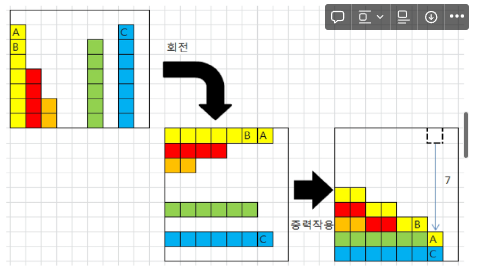

# monthly_exam_Algorithm

## 1차원 배열

- 1차원 배열의 선언

```python
arr = list()
arr = []
arr = [1, 2, 3]
arr = [0] * 10
```

- 1차원 배열의 접근

```python
arr[0] = 10        # 배열 arr의 0번 원소에 10 저장
arr[idx] = 20    # 배열 arr의 idx번 원소에 20을 저장하라
```

- 연습문제1 - Gravity
  - 그림 설명
    - 총 26개의 상자가 회전 후, 오른쪽 방 그림의 상태가 된다. A 상자의 낙차가 7로 가장 크므로 7을 리턴하면 된다.
    - 회전 결과, B상자의 낙차는 6, C상자의 낙차는 1
    - 


```python

```

